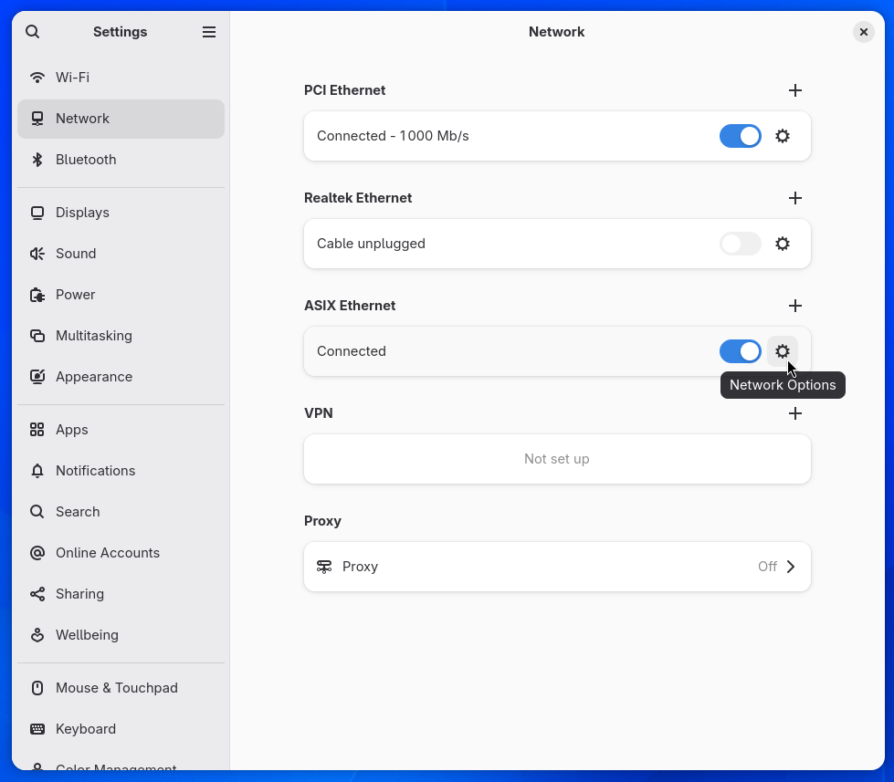
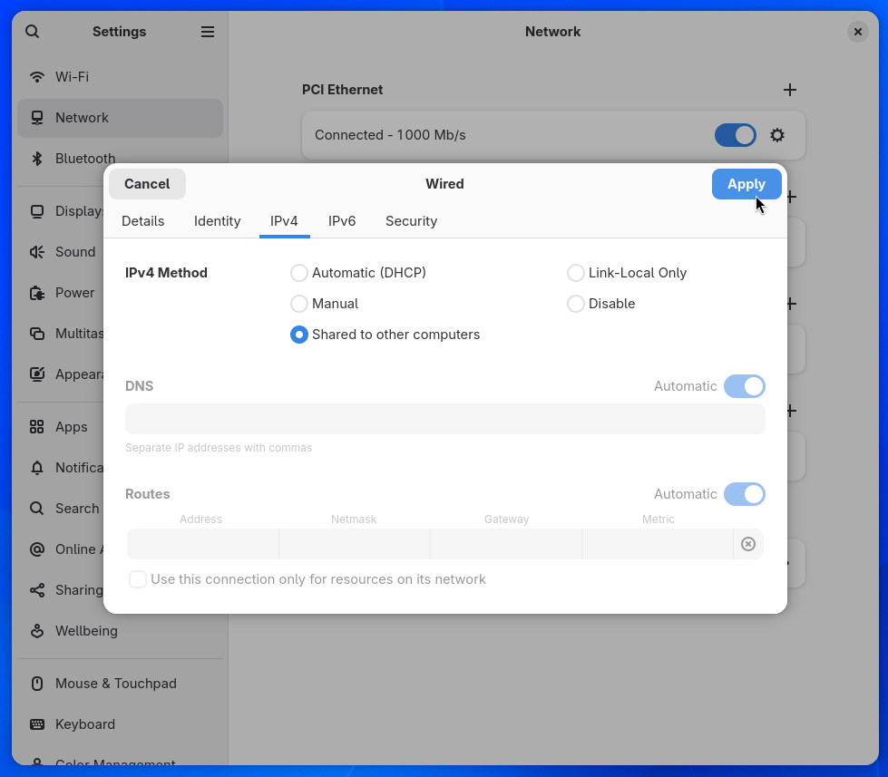

# Enabling Internet Connection Sharing (ICS)

## Overview

Internet Connection Sharing (ICS) allows a computer with an active internet connection to share that connection with other devices through another network interface (Ethernet, Wi-Fi, etc.).

## Windows

1. Open **Control Panel**.

2. Navigate to:

   ```text
   Network and Internet > Network and Sharing Center > Change adapter settings
   ```

3. Right-click the network adapter that has internet access.

4. Select **Properties**.

5. Open the **Sharing** tab.

6. Check:

   ```text
   Allow other network users to connect through this computer's Internet connection
   ```

7. Select the adapter that will receive the shared connection.

8. Click **OK**.

The PlanktoScope display should update and show an ip address different than `192.168.4.1`.

## macOS

1. Open **System Settings**.

2. Navigate to:

   ```text
   General > Sharing
   ```

3. Select **Internet Sharing**.

4. Choose the source connection from:

   ```text
   Share your connection from:
   ```

   Examples:

   * Wi-Fi
   * Ethernet
   * Thunderbolt Bridge

5. Choose the destination interface under:

   ```text
   To computers using:
   ```

6. Enable **Internet Sharing**.

7. Confirm the prompt.

The PlanktoScope display should update and show an ip address different than `192.168.4.1`.

## Linux

On distributions with the GNOME desktop environment such as Ubuntu, Fedora, Debian

1. Open **Settings**

2. Navigate to **Network**

3. Open the **Network Options** of the adapter that will receive the shared connection

4. Navigate to **IPv4**

5. Select **Shared to other computers**

6. Press **Apply**

The PlanktoScope display should update and show an ip address different than `192.168.4.1`.




